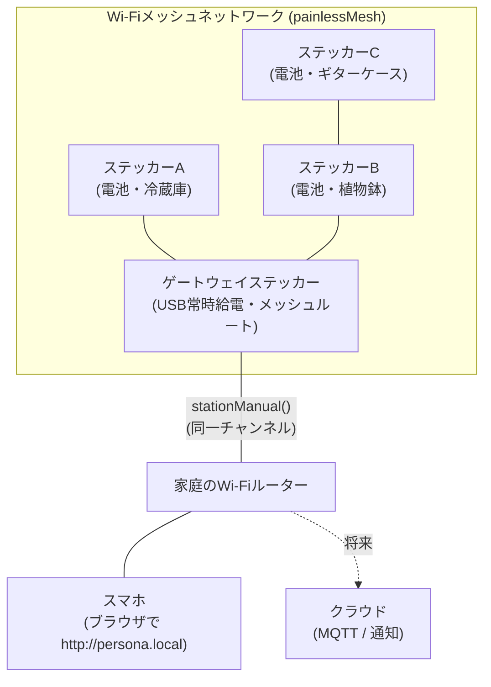
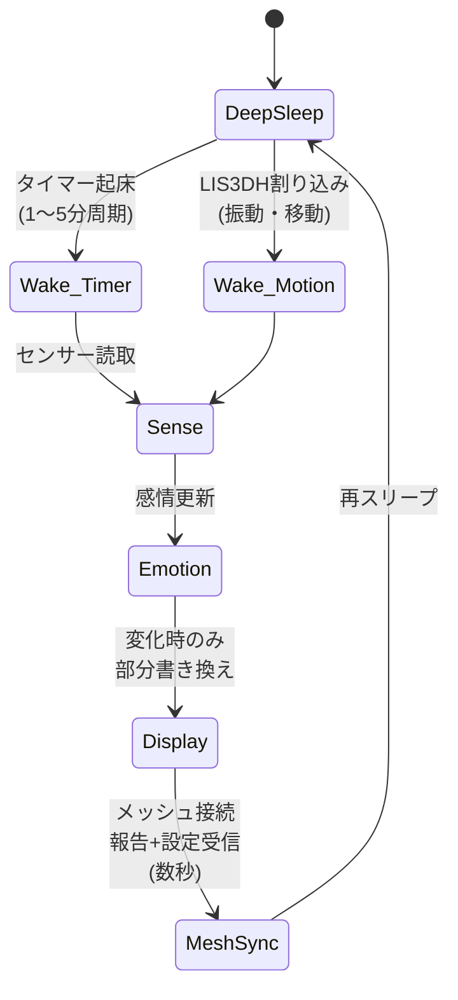

# 02. システム構成 — PersonaSticker

> ステータス: Phase 0(プランニング)/ 最終更新: 2026-08-23
> 前提: [01_requirements.md](./01_requirements.md)

## 1. 全体構成



- **ノード**(通常のステッカー): 電池駆動。センシング・感情生成・表示を自律的に行い、周期的にメッシュへ参加して状態報告・設定受信する
- **ゲートウェイ**(1台): ハードウェアはノードと同一。USB給電され、メッシュルート + ルーターブリッジ + Webサーバーを兼ねる
- **スマホ**: 専用アプリ不要。同一LAN内のブラウザからゲートウェイのWeb UIへアクセスする

## 2. ネットワーク設計

### 2.1 メッシュ: painlessMesh(第一候補)

- Arduino/PlatformIO で実績豊富、自律的にメッシュを形成・自己修復する
- ゲートウェイは `setRoot(true)` + `stationManual(SSID, PASS)` で**メッシュとルーターの両方に接続**する(制約: メッシュとルーターは**同一Wi-Fiチャンネル**である必要がある → 初回設定時にルーターのチャンネルへメッシュを合わせる)
- 代替案: ESP-IDF の **ESP-WIFI-MESH**(ルーター接続をネイティブサポート、大規模向き)。painlessMesh で問題が出た場合の移行先として温存する

### 2.2 メッセージ設計(JSON)

メッシュ上のメッセージはJSONで統一する。主要メッセージ:

```jsonc
// ノード → ゲートウェイ: 状態報告(周期 or イベント時)
{
  "type": "report",
  "id": "sticker-a1b2c3",        // MACベースの固有ID
  "seq": 128,
  "battery_mv": 3900,
  "sensors": { "temp_c": 26.5, "hum_pct": 55, "lux": 320, "vib_rms": 0.02 },
  "emotion": { "valence": 0.3, "arousal": -0.5, "face": "sleepy" },
  "events": ["motion_wake"]       // 割り込み起床の理由など
}
```

```jsonc
// ゲートウェイ → ノード: 設定同期(報告への応答として返す)
{
  "type": "config",
  "id": "sticker-a1b2c3",
  "rev": 7,                       // 設定リビジョン。ノードは自分のrevより新しければ適用
  "name": "れいぞうこ",
  "personality": { "sensitivity": 0.8, "temperament": "shy" },
  "report_interval_s": 120,
  "thresholds": { "cold_c": 10, "hot_c": 30, "lonely_h": 48 }
}
```

- ノードはスリープ中メッセージを受け取れないため、**設定はゲートウェイ側で保持し、ノードの報告時に応答として同期**する(pull型)
- ゲートウェイは最新の全ノード状態をメモリ + NVSに保持し、Web UIへ供給する

### 2.3 時刻

ゲートウェイがNTPで時刻を取得し、config応答に載せてノードへ配布する(「放置時間」「昼夜」の判定に使用)。

## 3. 電力戦略(最重要設計事項)

**課題**: 電子ペーパーは超省電力(画像保持0mA)だが、Wi-Fiメッシュ常時接続はESP32-S3で常時数十mA〜を消費し、電池数日で尽きる。

**方針**: ノードは**ディープスリープ主体 + 周期起床 + イベント割り込み起床**とする。



- **タイマー起床**: 1〜5分ごと(設定可能)。センサー読取 → 感情更新 → 表示更新(変化時のみ)→ メッシュ接続して報告・設定受信 → 再スリープ
- **割り込み起床**: LIS3DH の動作割り込み(INTピン)で即時起床し、「びっくり」等の即応表示を行う
- **メッシュ接続時間の最小化**: 起床のたびにメッシュへjoin(数秒)→ 送受信 → 切断。毎回の起床でメッシュ同期せず「N回に1回だけ同期」するモードも用意して電池寿命を延ばせるようにする
- **表示はスリープに影響しない**: 電子ペーパーは書き換え時のみ電力を消費し、スリープ中も表情が残る
- **ゲートウェイのみ常時オン**(USB給電)。メッシュの土台とWebサーバーを担う

概算の電池寿命試算は [03_hardware_design.md](./03_hardware_design.md) の電力収支表を参照。

## 4. Webアプリ(スマホ連携)

- 実装: ゲートウェイ上の **ESPAsyncWebServer**。UIは単一HTML(+最小限のJS/CSS)をLittleFSに格納
- アクセス: mDNS で `http://persona.local`(非対応端末向けにIP直打ちも案内)
- リアルタイム更新: **WebSocket** でノード状態をプッシュ
- REST API(Web UIと将来のクラウド連携が共用):

| メソッド | パス | 内容 |
| --- | --- | --- |
| GET | `/api/stickers` | 全ステッカーの最新状態一覧 |
| POST | `/api/config` | 名前・性格・閾値・報告間隔の変更(body内の`id`で対象指定、rev++) |
| GET | `/api/system` | 稼働時間・IP・ヒープ等のゲートウェイ情報 |
| WS | `/ws` | 新しい報告のリアルタイムプッシュ |

- 初回セットアップ: ゲートウェイが未設定時はAPモード(`PersonaSticker-Setup`)で起動し、スマホから接続してルーターのSSID/パスワードを入力するキャプティブポータル方式

## 5. セキュリティ(最低限)

- メッシュはpainlessMeshのパスワードで閉域化する
- Web UIはLAN内限定(ポート開放しない)。クラウド連携時(Phase 5)に認証を再設計する
- Wi-Fi認証情報はNVSに保存し、リポジトリにはコミットしない

## 6. コンポーネント間の責務まとめ

| コンポーネント | 責務 |
| --- | --- |
| ノードFW | センシング / 感情エンジン / 表示 / スリープ管理 / メッシュ報告 |
| ゲートウェイFW | メッシュルート / ルーターブリッジ / 全ノード状態保持 / Webサーバー / NTP |
| Web UI | 一覧・詳細表示 / 設定変更 / 初回セットアップ |
| (将来)クラウド | 外出先アクセス / 通知 |

ファームウェアの内部構造は [04_firmware_design.md](./04_firmware_design.md) を参照。
