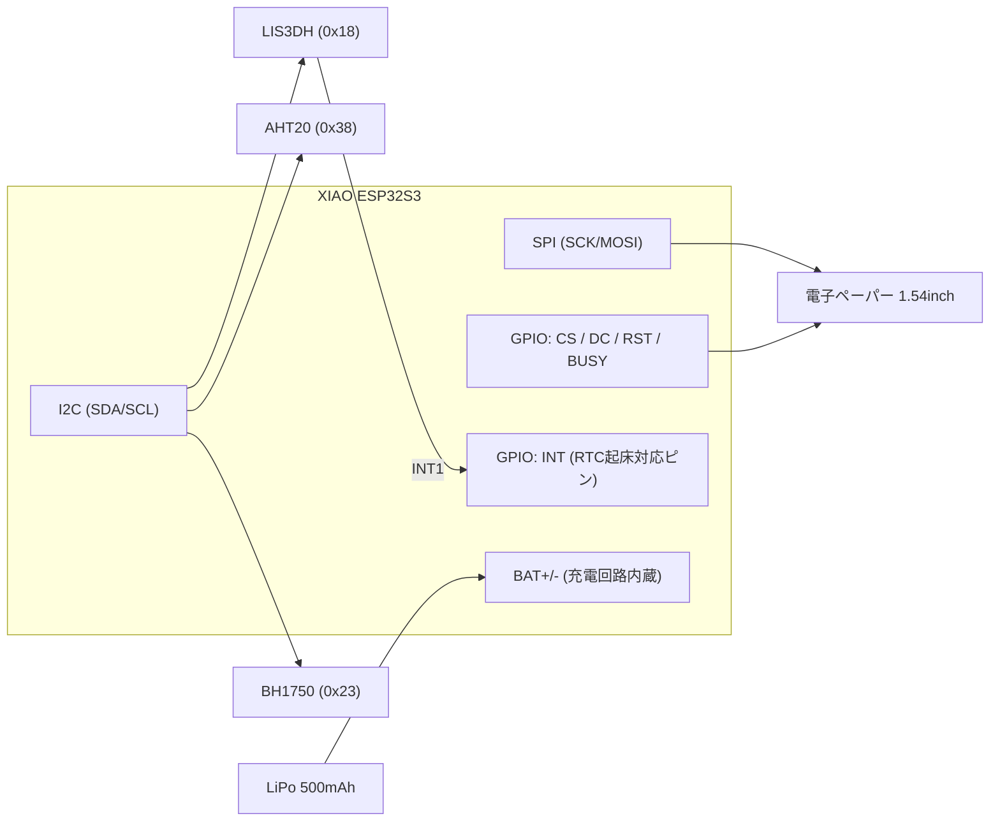

# 03. ハードウェア設計 — PersonaSticker

> ステータス: Phase 0(プランニング)/ 最終更新: 2026-08-23
> 前提: [01_requirements.md](./01_requirements.md), [02_system_architecture.md](./02_system_architecture.md)

## 1. 試作フェーズのBOM(開発ボード段階)

1台あたりの構成。ノードとゲートウェイは同一ハードウェア(ゲートウェイはUSB給電で運用するだけ)。

| # | 部品 | 型番(候補) | I/F | 選定理由 | 参考価格 |
| --- | --- | --- | --- | --- | --- |
| 1 | MCU | **Seeed XIAO ESP32S3** | — | 超小型(21×17.5mm)、LiPo充電回路内蔵、ESP32-S3(Wi-Fi+BLE) | ~1,300円 |
| 2 | 表示 | **Waveshare 1.54inch e-Paper Module V2**(GDEH0154D67, 200×200) | SPI | **部分書き換え対応(約0.3秒)**。表情切替に必須。GxEPD2対応 | ~2,000円 |
| 3 | 温湿度 | **AHT20**(代替: SHT31) | I2C | 安価・十分な精度・低消費 | ~300円 |
| 4 | 加速度 | **LIS3DH** | I2C + INT | 超低消費(~2µA)、**動作割り込みでディープスリープから起床可能** | ~500円 |
| 5 | 照度 | **BH1750** | I2C | 定番・lux直読み | ~300円 |
| 6 | 電池 | LiPo 3.7V **500mAh**(厚さ~5mm級) | — | XIAOのBAT端子へ直結(充電回路内蔵) | ~800円 |
| 7 | その他 | ブレッドボード、ジャンパ、スライドスイッチ | — | 試作用 | ~500円 |

**1台あたり合計: 約5,700円**。Phase 1で1台、Phase 2で合計3台(うち1台ゲートウェイ)を想定。

- 代替MCUボード: **ESP32-S3-DevKitC-1 (N8R8)** — ピンが多くデバッグしやすいが大きい。XIAOで問題が出た場合の予備
- 注意: XIAO ESP32S3 はGPIOが少ない(11本)。下記ピン割当で足りることを確認済み

## 2. 配線(試作)

ピン割当(暫定・Phase 1で確定させる):

| XIAO ピン | 接続先 | 備考 |
| --- | --- | --- |
| GPIO7 (SCK) / GPIO9 (MOSI) | e-Paper SCK / DIN | HW SPI。MISO不使用 |
| GPIO1 / GPIO2 / GPIO3 / GPIO4 | e-Paper CS / DC / RST / BUSY | |
| GPIO5 (SDA) / GPIO6 (SCL) | AHT20, LIS3DH, BH1750 | I2Cバス共有(アドレス重複なし) |
| GPIO8 | LIS3DH INT1 | **RTC GPIOであること**(ディープスリープ起床用)→ Phase 1で実機確認 |
| BAT+/− | LiPo | 電池電圧はADC分圧で監視(要追加抵抗2本)or 充電IC状態で代用 |

## 3. 電力収支の概算

前提: LiPo 500mAh、報告周期2分、感情変化による表示更新は1時間に4回、振動起床は1日20回。

| 状態 | 電流(概算) | 継続時間/回 | 備考 |
| --- | --- | --- | --- |
| ディープスリープ | ~20µA | 常時ベース | XIAO実測はPhase 3で確認(USBシリアル系でこれより増える可能性あり) |
| 起床+センサー読取 | ~40mA | 0.5秒 | Wi-Fiオフ |
| メッシュ接続+送受信 | ~100mA(ピーク) | 3秒 | join含む。**ここが支配項** |
| e-Paper部分書き換え | ~8mA | 0.3秒 | 頻度が低く影響小 |

概算(1日あたり): スリープ ≈ 0.5mAh、メッシュ同期 720回 × (100mA×3s) ≈ 60mAh、その他 ≈ 5mAh → **約65mAh/日 → 500mAhで約7日**。

**目標(2週間)に届かないため、以下のノブで調整する**(Phase 3):
- 報告周期を2分→5分(同期回数 720→288回/日 → 約26mAh/日 → **約17日**)✅
- 「N回に1回だけメッシュ同期」モード(表示は毎回更新、通信は間引く)
- メッシュjoin時間の短縮(固定チャンネル・固定親ノードのヒント保存)

→ **結論: 報告周期5分をデフォルトにすれば目標達成の見込み。** 実測して 03 のこの表を更新すること。

## 4. カスタムPCB化の方針(Phase 4)

仕様確定後、KiCad(バージョンは着手時に確定し `hardware/README.md` に記載)で設計する。

- **格納場所**: 既存の `hardware/` 構成をそのまま使う
  - `hardware/schematic/` — 回路図(.kicad_sch)
  - `hardware/pcb/` — 基板レイアウト(.kicad_pcb)、製造データは `hardware/pcb/gerbers/`
  - `hardware/bom/` — 部品表CSV
- **主要方針**:
  - MCUは **ESP32-S3-WROOM-1** モジュール直載せ(技適取得済みモジュールを使用)
  - 電子ペーパーは**ベアパネル(GDEH0154D67)をFPCコネクタで直結**し、基板裏に重ねて薄型化(昇圧回路等のリファレンス回路を基板側に実装)
  - 電源: 薄型LiPo + 充電IC(MCP73831)+ 3.3V LDO(低Iq品: XC6220等)
  - センサー(AHT20 / LIS3DH / BH1750)をチップ実装
  - 書き込み: USB-C(ESP32-S3内蔵USB)またはテストパッド+治具
  - 外形: 約55×45mm、総厚10mm以下(基板1.0mm + パネル + LiPo)
- **筐体**: ステッカーらしく見せる外装(3Dプリント薄枠 or ラミネート)はPhase 4で検討

## 5. リスクと対策

| リスク | 影響 | 対策 |
| --- | --- | --- |
| XIAOのディープスリープ電流が想定より大きい | 電池寿命未達 | DevKitC-1比較測定、最悪は電源スイッチIC追加(カスタムPCBで解決可能) |
| LIS3DH INTピンがRTC起床非対応ピンに割当 | 振動起床不可 | Phase 1最初にピン割当を実機確認 |
| e-Paper部分書き換えの残像・劣化 | 表示品質低下 | 定期的な全面リフレッシュ(例: 1時間に1回)をFWに組込み |
| メッシュとルーターのチャンネル不一致 | ゲートウェイがブリッジ不可 | セットアップ時にルーターのチャンネルを検出しメッシュへ適用 |
| 技適(電波法) | カスタムPCBで違法リスク | **技適取得済みWROOMモジュールを使用**(アンテナ自作はしない) |
