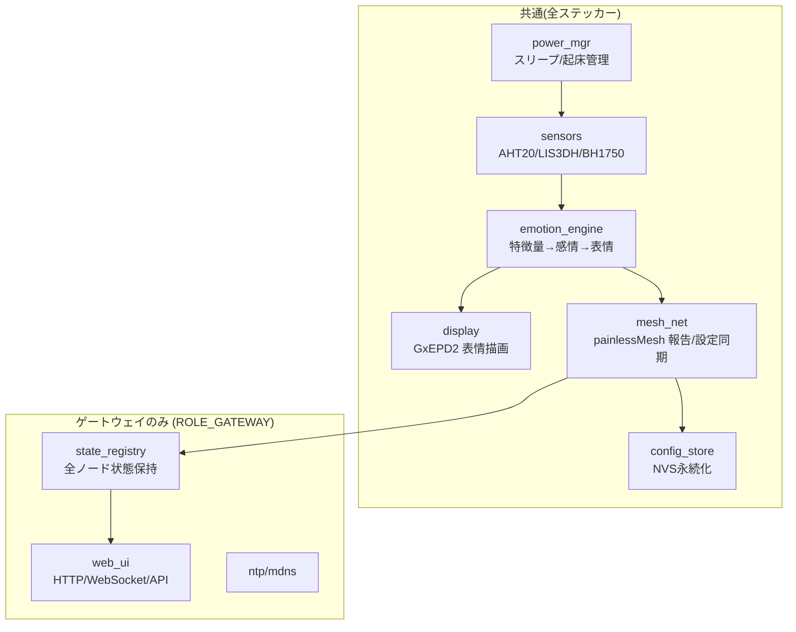
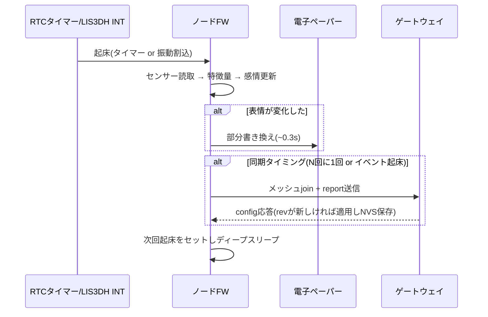

# 04. ファームウェア設計 — PersonaSticker

> ステータス: Phase 0(プランニング)/ 最終更新: 2026-08-23
> 前提: [02_system_architecture.md](./02_system_architecture.md), [03_hardware_design.md](./03_hardware_design.md)

## 1. 開発環境

- **PlatformIO + Arduino framework**(ESP32-S3)
  - 理由: painlessMesh / GxEPD2 などArduinoエコシステムのライブラリが充実しており試作が速い。将来ESP-IDFへ移行する場合もPlatformIOのままボード定義を切替可能
- ソース配置: `software/firmware/`(PlatformIOプロジェクト)、Web UIアセットは `software/firmware/data/`(LittleFS)
- ノードとゲートウェイは**同一ファームウェア**とし、ビルドフラグ(`-DROLE_GATEWAY`)または NVS 設定で役割を切替える

### 主要ライブラリ

| ライブラリ | 用途 |
| --- | --- |
| painlessMesh | Wi-Fiメッシュ |
| GxEPD2 | 電子ペーパー描画(GDEH0154D67対応) |
| Adafruit LIS3DH / AHTX0 / BH1750 | センサー |
| ESPAsyncWebServer + AsyncTCP | Web UI(ゲートウェイのみ) |
| ArduinoJson | メッシュメッセージ / API のJSON処理 |
| Preferences (NVS) | 設定・状態の永続化 |

## 2. モジュール構成



| モジュール | 責務 |
| --- | --- |
| `power_mgr` | 起床理由の判定(タイマー/振動INT)、ディープスリープ移行、RTCメモリへの状態退避 |
| `sensors` | 3センサーの初期化・読取、LIS3DH割り込み設定、特徴量の元データ提供 |
| `emotion_engine` | 特徴量抽出 → 感情モデル → 表情選択(後述) |
| `display` | 表情ビットマップの全面/部分書き換え、定期全面リフレッシュ |
| `mesh_net` | メッシュjoin/report送信/config受信、ゲートウェイではルート運用 |
| `config_store` | 名前・性格・閾値・報告周期のNVS保存(rev管理) |
| `state_registry`(GW) | 全ノードの最新report保持、履歴リングバッファ |
| `web_ui`(GW) | 静的UI配信、REST API、WebSocketプッシュ、初回セットアップAP |

## 3. 感情エンジン

### 3.1 パイプライン

```
センサー生値 ──► 特徴量抽出 ──► 感情モデル(2次元) ──► 表情マッピング ──► 表示
                                      ▲
                              性格パラメータ(NVS)
```

### 3.2 特徴量(例)

| 特徴量 | 算出 | 使われ方 |
| --- | --- | --- |
| `temp_dev` | 現在温度 − 快適域(閾値設定) | 寒い/暑い |
| `temp_rate` | 温度変化率(RTCメモリに前回値を保持) | 「急に寒くなった!」 |
| `vib_energy` | 起床間の振動強度(LIS3DHのFIFO/割込回数) | びっくり/なでられた |
| `idle_hours` | 最後に振動を検知してからの経過時間 | さみしい/ねむい |
| `lux` / `is_dark` | 照度、暗所判定 | ねむい/収納中 |
| `battery_pct` | 電池電圧 | 「おなかすいた」(低電圧表示) |

### 3.3 感情モデル: 2次元(Valence–Arousal)

- **valence(快 −1.0 〜 +1.0)** と **arousal(覚醒度 −1.0 〜 +1.0)** を特徴量の重み付き和で算出
- 例: 快適温度→valence+、急な衝撃→arousal+ & valence−、長期放置→valence− & arousal−
- **性格パラメータ**で重みを変調する:
  - `sensitivity`(0〜1): 特徴量→感情の反応の強さ(敏感/鈍感)
  - `temperament`: `cheerful`(valenceに+バイアス)/ `shy`(arousal反応大)/ `calm`(変化を平滑化)など数種
  - 慣性: 前回感情との指数移動平均で急変を抑制(calmほど平滑強)

### 3.4 表情マッピング(8種 + 特殊)

Valence–Arousal平面を8象限+中心に分割:

| 表情 | valence | arousal | 代表トリガー |
| --- | --- | --- | --- |
| うれしい 😊 | + | + | 快適+なでられ振動 |
| おだやか 🙂 | + | 0 | 快適・安定 |
| ねむい 😴 | 0 | − | 暗所・夜・無変化 |
| さむい 🥶 | − | −〜0 | 低温 |
| あつい 🥵 | − | + | 高温 |
| びっくり 😲 | 0〜− | ++ | 急な衝撃・移動 |
| こわい 😨 | − | + | 継続する強い振動 |
| さみしい 🥺 | − | − | 長期放置 |
| (特殊)おなかすいた | — | — | 低電池。他表情に優先 |

### 3.5 表情アセットと描画

- 200×200 1bit ビットマップ。`XBM`/`PROGMEM` 配列としてFWに埋込み(8種×フル + 目/口の差分パーツ)
- 感情変化時は**部分書き換え**(目・口の矩形領域のみ、約0.3秒)。まばたき等の簡易アニメも部分書き換え2〜3コマで表現
- **1時間に1回(または全面変化時)は全面リフレッシュ**して残像・焼付きを防止
- 表情のほか、名前・温度・電池アイコンを画面下部に小さく表示

## 4. 実行フロー

### 4.1 ノード(電池駆動)



- 短命な状態(前回温度、感情EMA、同期カウンタ)は**RTCメモリ**、設定は**NVS**に保持する

### 4.2 ゲートウェイ(常時給電)

- 常時メッシュルートとして稼働し、reportを受信するたび `state_registry` を更新 → WebSocketで接続中ブラウザへプッシュ
- Web UIからの設定変更は `rev` をインクリメントして保持し、該当ノードの次回report時に応答で配布
- NTP同期・mDNS(`persona.local`)・未設定時のセットアップAPモードを担当

## 5. Web UI(ゲートウェイ内蔵)

- 単一HTML + Vanilla JS(ビルドツール不要、LittleFSに格納)。スマホ幅最適化
- 画面:
  1. **ホーム**: 全ステッカーのカード一覧(表情アイコン・名前・温度・電池・最終報告時刻)
  2. **詳細**: センサー値の直近履歴(ゲートウェイ保持分)、感情の推移
  3. **設定**: 名前・性格(sensitivity / temperament)・閾値・報告周期の編集
  4. **セットアップ**: 初回のWi-Fi設定(APモード時のみ)
- API仕様は [02_system_architecture.md](./02_system_architecture.md#4-webアプリスマホ連携) を参照

## 6. テスト方針

- **感情エンジンは純粋ロジックとして分離**し、PC上でネイティブユニットテスト(PlatformIOの `native` env + Unity test)を回す(センサー値系列 → 期待表情のテーブルテスト)
- メッシュ・表示はハードウェア依存のため実機確認をフェーズごとのDoDに含める(→ [05_roadmap.md](./05_roadmap.md))
- シリアルログレベルをビルドフラグで切替(電池運用時はログ無効)
